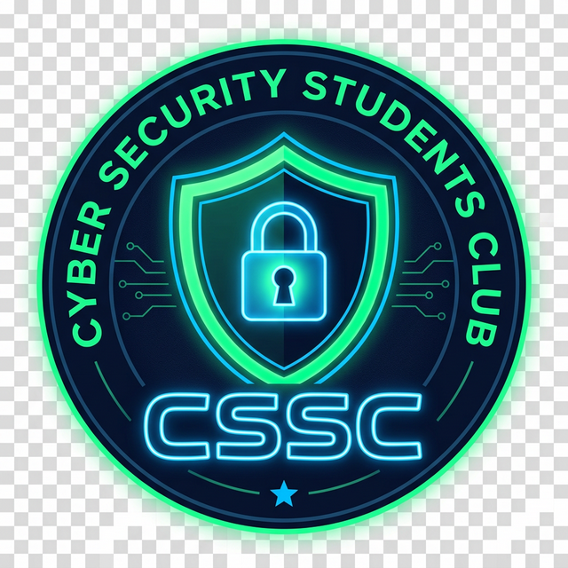

# 🛡️ CSSC — Cyber Security Students Club



A high-performance, futuristic web platform for the **Cyber Security Students Club (CSSC)**. This project features a state-of-the-art frontend with dynamic animations and a robust Flask-based backend for member management.

---

## ✨ Key Features

### 🎨 Frontend Excellence
- **Cyber-Themed UI**: A stunning dark-mode interface with neon accents and high-end aesthetics.
- **Dynamic Background**: Interactive particle-based canvas background that reacts to user movement.
- **Micro-Animations**: Smooth scroll-reveal effects and typing animations for a premium feel.
- **Fully Responsive**: Optimized for every screen size, from desktops to mobile devices.
- **Real-time Countdown**: Live timer ticking down to the club's official launch.

### ⚙️ Backend Power
- **Member Registration**: Secure portal for new members to join, featuring instant validation.
- **Admin Dashboard**: A restricted portal for club leadership to view, manage, and export member data.
- **Single Session Control**: Advanced token-based authentication prevents multiple simultaneous admin logins.
- **Data Integrity**: Automatic migration from CSV to SQLite for enhanced performance and scalability.
- **Sanitized Inputs**: Full protection against XSS and injection attacks via backend sanitization.

---

## 📂 Project Architecture

```text
CSSC-main/
├── frontend/             # Desktop & Mobile UI
│   ├── assets/           # Team photos, logos, and icons
│   ├── index.html        # Landing Page
│   ├── about.html        # Vision & Mission
│   ├── team.html         # Leadership & Core Committee
│   ├── register.html     # Membership Portal
│   ├── script.js         # Frontend logic & animations
│   └── styles.css        # The Futuristic Design System
│
├── backend/              # Security & Data API
│   ├── app.py            # Flask Engine
│   ├── .env              # Security Configurations
│   └── requirements.txt  # Python Dependencies
│
└── instance/             # Database Storage
    └── cssc_members.db   # SQLite Persistent Storage
```

---

## 🚀 Quick Start Guide

### 1. Initialize the Environment
Ensure you have Python 3.8+ installed. Navigate to the root directory and install dependencies:
```bash
pip install -r backend/requirements.txt
```

### 2. Configure Security
Create or update the `backend/.env` file with your credentials:
```env
SECRET_KEY=y0ur_sup3r_s3cr3t_k3y_123!
ADMIN_USER=nadimshaikh@cssc
ADMIN_PASS=technicalteam@cssc
DATABASE_URL=sqlite:///cssc_members.db
```

### 3. Launch the Platform
Start the backend engine:
```bash
python backend/app.py
```
*Backend live at: http://localhost:5000*

In a separate terminal, serve the frontend:
```bash
python -m http.server 5500 --directory frontend
```
*Frontend live at: http://localhost:5500*

---

## 🛠️ Customization & Maintenance

### Updating Team Photos
Place new photos in `frontend/assets/`. Update `frontend/team.html` by replacing the `src` attribute in the respective `img` tag. The system includes an automatic fallback to member initials if an image fails to load.

### Adding New Events
Navigate to `frontend/index.html` and locate the `<section id="events">`. Simply duplicate an event card and update the details.

### Admin Panel Access
Access the secure dashboard at `http://localhost:5000/admin`. From here, you can:
- � View real-time membership stats.
- 📥 Download the complete member list as a **CSV**.
- �️ Manage records with one-click deletion.

---

## 🔒 Security Standards

- **Session Hardening**: Admin tokens are rotated and strictly enforced for single-session use.
- **XSS Prevention**: All user-provided strings are stripped of HTML tags before database entry.
- **ORM-based Queries**: SQLAlchemy is used to prevent SQL injection.
- **Validation**: Recursive checks on both client and server sides ensure data consistency.

---

## 🌐 Deployment Recommendation

For a production-grade deployment:
1. **Frontend**: Host on **GitHub Pages**, **Vercel**, or **Netlify**.
2. **Backend**: Deploy to **Render**, **Railway**, or **Heroku**.
3. **Database**: Use the included SQLite for small-scale or upgrade to PostgreSQL for large-scale deployments.

---

*Built with passion by the CSSC Technical Team · 2026*
